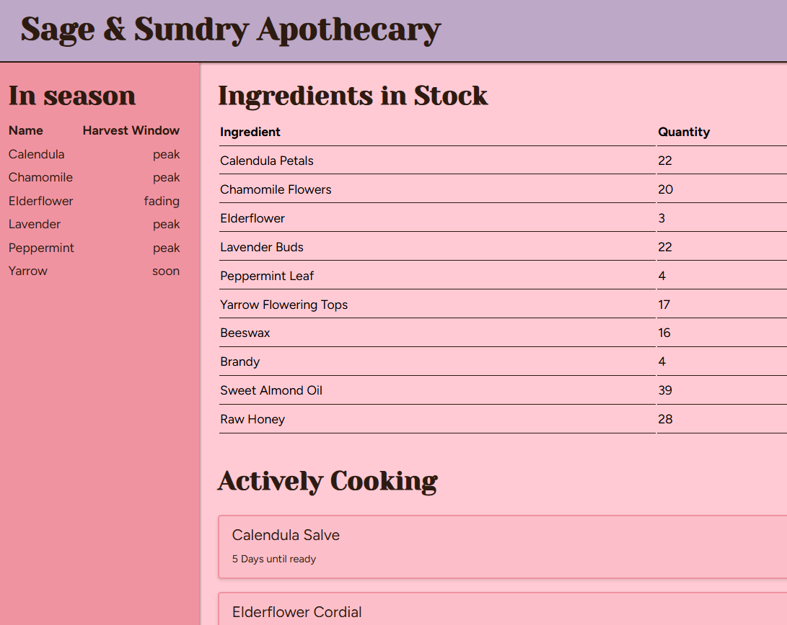

<!-- markdownlint-disable -->

# Baseline Magic: The Art of Intent-Driven CSS

### Linda Thompson

Software engineer

<p class="text-xs">
Photo by <a href="https://unsplash.com/@anitaaustvika?utm_source=unsplash&utm_medium=referral&utm_content=creditCopyText">Anita Austvika</a> on <a href="https://unsplash.com/photos/a-glass-jar-filled-with-dried-herbs-on-a-checkered-table-cloth-MEZFIgrCQMA?utm_source=unsplash&utm_medium=referral&utm_content=creditCopyText">Unsplash</a>
</p>

<!--
Welcome everyone, and thanks so much for being here. My name is Linda, and I'm a software engineer, team builder, and a video game enthusiast. Today, I invite you to go on a journey with me to a land where CSS is magical. Here we don't have to fight so hard against the cascade, we worth alongside it. We don't throw all the hacks we can think of to override a framework style, we declare it in it's place then apply our own styles and it just works. We don't search through the repository to find all of the files that need a single color or font changes, we declare it once and reuse it everywhere. Because in today's world...
-->

---
layout: statement
---

# In today's modern world, CSS is a system of intent.

<!-- 
...CSS is a system of intent. This world isn't a fantasy - it's live in all modern browsers and broadly available. This is what I want you to come away with today, a new way of looking at CSS fundamentals that rekindle the joy of building things for the web. To showcase these, we're going to build out a dashboard for a small apothecary shop, one ingredient at a time.
-->

---

# Custom Properties

Variables we define and reuse throughout our stylesheets. More consistency, less repetition.

<div class="grid grid-cols-2 gap-4 items-center">

<div>

```css
:root {
    /* Primitive color values */
    --text-color: #2D1B11;
    --spring-primary-color: #FFCAD4;
    --spring-secondary-color: #F093A1;
    --spring-accent-color: #BDA8C7;

    /* Semantic color properties */
    --primary-color: var(--spring-primary-color);
    --secondary-color: var(--spring-secondary-color);
    --accent-color: var(--spring-accent-color);
  }

/* Then in our component/page */
  header {
    background: var(--accent-color);
    border-bottom: 2px solid var(--text-color);
  }
```

</div>

<div>

</div>

</div>

<v-click> We have the tokens. Now let's make sure our layout understands where it is. </v-click>

<!-- 
Our first ingredient is custom properties. CSS now has a way to declare it's own variables and let us reuse them across our styles. They always start with two dashes, then whatever name we want. And when we want to use them, we wrap that name in the var() function. And now, if one of our colors changes, we have a single place we need to put the new value and all of the places we're using it will update automatically.

With our tokens in place, next we'll focus on our layout and how it can know the amount of space it should take up.
-->

---

# Container Queries & Logical Properties

The component knows its space. Now let's have the dashboard respond to its own state.

---

# The `:has` Selector

We have tokens, responsive components, and parent logic. Let's talk about keeping all of it organized.

---

# Cascade Layers

```css
/* Set the ordering first to guarantee our intention. */
@layer reset, base, layout, theme;
/* Can import other stylesheets and assign to a layer. */
@import "reset.css" layer(reset);
/* Then we write the actual style rules where they make sense. */
@layer base {
  :root {
    /* ...our tokens from the last slide */
  }
}
@layer layout {
  header {
    display: flex;
    align-items: center;
    /* ... */
  }
}
@layer theme {
  /* ...the header from the last slide */
}
```

<v-click>The shop is built. Now for the things that make it feel alive.</v-click>

<!-- 
order is king - declare the layer orders you want first, then you can write or organize them however you want and it won't matter
especially great for framework styles like from tailwind or shadcn - put their layer lower than your other ones and yours will rule
styles not in a layer have higher specificity than your layers - so the ordering goes user stylesheet (browser), user styles (user settings), the layers you describe, then unlayered styles
this ordering and the ability to do it to our authored styles is the biggest takeaway from this; this gives us more control over our own styles, letting us manage the importance of them without having to resort to super specific class names or important tags. 
if you mention important - note that using it flips the ordering, so a browser style having important actually makes it the most important instead of the least again 
-->

---

# View Transitions

State changes feel intentional. But what about elements that need to stay physically connected?

---

# Anchor Positioning

Tethered elements are the browser's job, not yours.

---

<!-- full dashboard view -->

---

# Closing Thoughts

Stop fighting the browser. Collaborate with it.

---
layout: end
---

# Connect with Me
