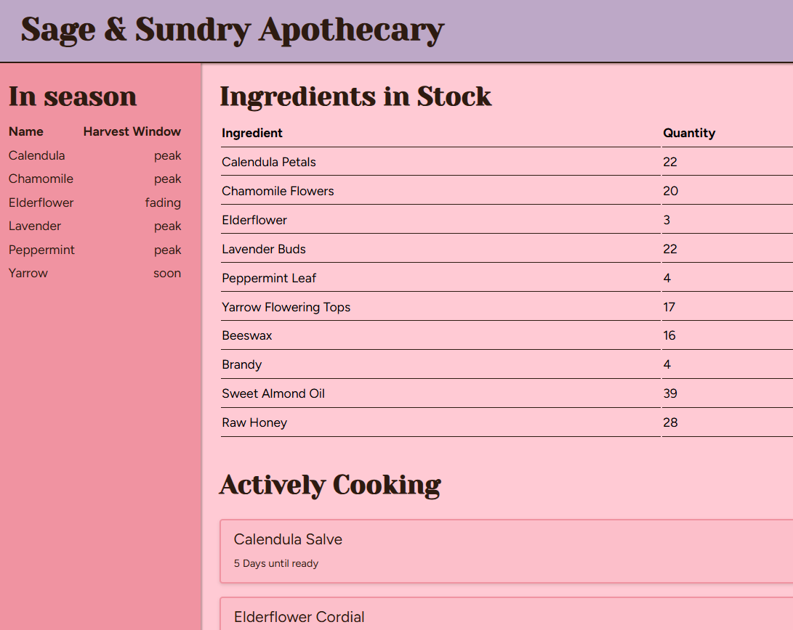

<!-- markdownlint-disable -->

# Baseline Magic: The Art of Intent-Driven CSS

### Linda Thompson

Software engineer

<p class="text-xs">
Photo by <a href="https://unsplash.com/@anitaaustvika?utm_source=unsplash&utm_medium=referral&utm_content=creditCopyText">Anita Austvika</a> on <a href="https://unsplash.com/photos/a-glass-jar-filled-with-dried-herbs-on-a-checkered-table-cloth-MEZFIgrCQMA?utm_source=unsplash&utm_medium=referral&utm_content=creditCopyText">Unsplash</a>
</p>

<!--
Welcome everyone, and thanks so much for being here. My name is Linda, and I'm a software engineer. 

Today we're going to get a little witchy and learn some CSS magic.

You might know some of the old magic, hacking styles to create the designs you want. Or you might be newer to the craft, scared from horror stories of old or intimdated by all there is to know. Maybe, like me, you want to find a balance of using modern tools to create for us, while still growing and cultivating our own skillset. 

Today I hope to help you do just that. Because in today's modern world...
-->

---
layout: statement
---

# In today's modern world, CSS is a system of intent.

<Footer />

<!-- 
...CSS is a system of intent. 

The features we'll cover today aren't a fantasy - they're available in all modern browsers and baseline widely available. My goal is that by the end of our time together, you'll walk away with a new way of looking at some fundamental CSS capabilities that spark joy in building for the web. 

To showcase these, we're going to create a dashboard for a small apothecary shop called Sage & Sundry. Let's go one ingredient at a time.
-->

---

# Custom Properties

Variables we can define and reuse. More consistency, less repetition.

<div class="grid grid-cols-2 gap-4 items-center">

<div>

```css
:root {
  /* Declare the variable */
  --spring-primary-color: #FFCAD4;
  /* Then use it in other variables */
  --primary-color: var(--spring-primary-color);
}

/* Or directly within components */
main {
  background: var(--primary-color);
}

/* Can also give the browser more info */
@property --primary-color {
  syntax: "<color>";
  inherits: true;
  initial-value: #ffcad4;
}
```

</div>

<div>

</div>

</div>

<v-click> We have the tokens. Now let's make sure our layout understands where it is. </v-click>

<Footer />

<!-- 
widely avail, 96%

We'll start at the very beginning. A very good place to start - and also with something a number of you might have seen before. These are custom properties. CSS now has a way to let us declare reusable values that we can share across our styles. 

They always start with two dashes and a name. Then when we want to use that value, we call it with the var() function. The beauty of these is in simplification. We have one place now where we can store our colors or fonts or anything we find ourselves reusing or wanting to change easily. We can sprinkle these throughout our site, and with small updates our whole page will change. 

These are a fundamental building block of our intentional CSS foundation. 

With our tokens in place, next we'll focus on our layout and how it can know the amount of space it should take up.
-->

---

# Container Queries & Logical Properties

The component knows its space. Now let's have the dashboard respond to its own state.

<Footer />

<!-- 
widely avail, size queries 92%
-->

---

# The `:has` Selector

We have tokens, responsive components, and parent logic. Let's talk about keeping all of it organized.

<Footer />

<!-- 
widely avail, 93%
-->

---

# Cascade Layers

```css
/* Set the ordering first to guarantee our intention. */
@layer reset, base, layout, theme;
/* Can import other stylesheets and assign to a layer. */
@import "reset.css" layer(reset);
/* Then we write the actual style rules where they make sense. */
@layer base {
  :root {
    /* ...our tokens from the last slide */
  }
}
@layer layout {
  header {
    display: flex;
    align-items: center;
    /* ... */
  }
}
@layer theme {
  /* ...the header from the last slide */
}
```

<v-click>The shop is built. Now for the things that make it feel alive.</v-click>

<Footer />

<!-- 
widely avail, 94%
Cascade layers give us a lot of our power to better handle how styles affect each other. You've probably heard the word cascade a ton, it is what the C in CSS stands for after all. At a high view, the cascade is the idea of styles starting from a point and then layering one on top of the other to replace each other and build out how our sites look. Browser defaults get applied first, then a browser user's individual settings if they have some, then our authored styles. 

What layers gives us is a way to apply this same organiziational effect to all of the styles in our app. Where before everything was sitting at the same layer of specificity, now we have the power to determine what should be more and less important, without having to resort to the important flag our super long class names and identifiers.

Order is the name of the game here, so you'll often see a single definition at the start of the first CSS file that gets imported into your app. The first time a layer's name is seen determines the order it goes in, and the first one is the easiest to overwrite so that order is important. Then, once the order is declared, we can start assigning values to each layer.

There's two methods - we can import a file and assign it to a layer, like I'm doing with the reset stylesheet here. This is also super helpful if you're using something like Tailwind or a component library that has it's own styles - you can say that their styles go first, so what you want to change to make uniquely yours has an easier time taking the spotlight. 

Or we can use the @layer syntax with the name and nest our styles inside it. Since we already declared the order we want at the top of our file, we can reuse this layer name in multiple files, and they all get added to the same layer. We can also list them in any order and it won't matter, because we've already told the browser what order to apply them in.

Then if you really need something to take the highest value and go above everything, any styles that are not inside a layer get the highest specificity. 

These layers help us to keep our concerns separate, and be able to update and replace values without having to make things harder on ourselves to come up with more and more detailed names. We can just say what we want and what order they should go in, and the browser knows what to do with it. 

So now we have the majority of our shop designed and laid out! Now let's add a little more magic and movement to it. These next two properties are newly available in baseline and really make our app come alive.
-->

---

# View Transitions

State changes feel intentional. But what about elements that need to stay physically connected?

<Footer />

<!-- 
newly avail, 88% single-page
-->

---

# Anchor Positioning

Tethered elements are the browser's job, not yours.

<Footer />

<!-- 
newly avail, 82%
-->

---

<Footer />
<!-- full dashboard view -->

---
layout: center
---

# Closing Thoughts

Stop fighting the browser. Collaborate with it.

<Footer />

<!-- 

-->

---
layout: end
---

# Connect with Me

<!-- 
qr code with a link to the slides/site/references, and how to connect w/ me. either need to build something out for this or make the qr code link to my site and have a url for the codebase (probably a link to the codebase from my portfolio too)
-->
